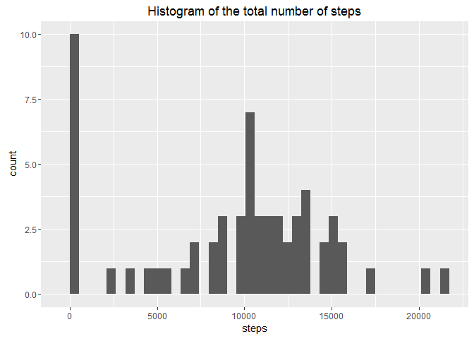
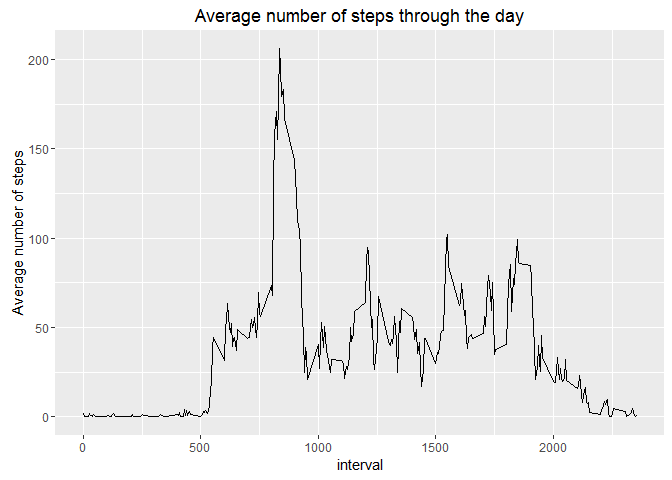
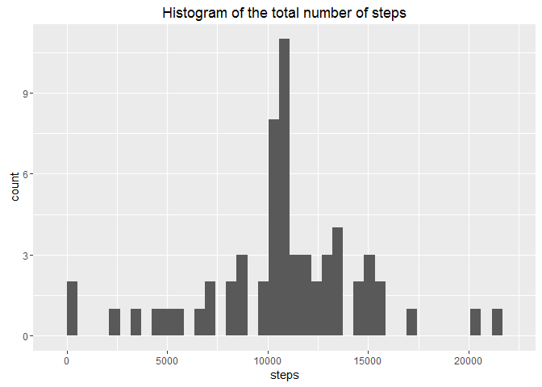
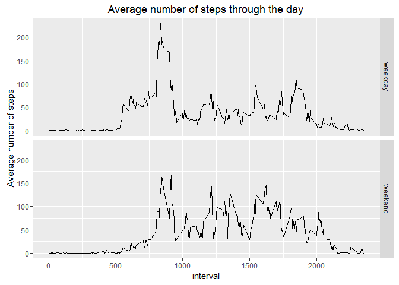

# Reproducible Research: Peer Assessment 1


## Loading and preprocessing the data


```r
# Step 1: Loading the data
data <- read.table(unz("activity.zip","activity.csv"),sep=",", header = TRUE)
# Step 2: Transforming the dates into R Date objects
data[,"date"] <- as.Date(data[,"date"],format="%Y-%m-%d")
```


## What is mean total number of steps taken per day?


```r
#Step 1: calculating the total number of steps per day 
#       and assigning column names
stepsperday <- summarise(group_by(data,date),sum(steps, na.rm=TRUE))
colnames(stepsperday) <- c("date","steps")

#Step 2: histogram of total number of steps taken per day
qplot(steps,data = stepsperday, bins=40, 
      main = "Histogram of the total number of steps")
```

\

```r
#Step 3: Calculating the mean and median
meansteps <- mean(stepsperday$steps)
mediansteps <- median(stepsperday$steps)
```

The **mean** number of steps per day is **9354.2295082** and the **median** number
of steps per day is **10395**.  


## What is the average daily activity pattern?


```r
# Step 1: time series plot of 5-minute intervals

# grouping by intervals and assigning column names
intervals <- summarize(group_by(data,interval), mean(steps, na.rm = TRUE))
colnames(intervals) <- c("interval","avgsteps")
#plot
qplot(interval,avgsteps,data=intervals, geom="path", ylab=c("Average number of steps"), main="Average number of steps through the day")
```

\

```r
# Step 2: finding the interval containing maximum number of steps
maxinterval <- as.numeric(intervals[which.max(intervals$avgsteps),"interval"])
```

**Interval 835** contains the **maximum number of steps** averaged across all days. It appears that the subject is most active in the morning hours.

## Imputing missing values


```r
# Step 1: calculate the number of missing values
numofna <- sum(is.na(data))
```

There are **2304** missing values in the dataset. 

#### Step 2: Devise a strategy for filling in the missing values
It appears that the missing values can all be found within a few days. On those days, it seems that the value for every interval of the day is missing, so it's likely that the subject simply didn't carry the measuring device. Therefore, a good strategy for imputing the missing values would be to take the mean value of each 5-minute interval averaged over all days.


```r
# Step 3: Create a new dataset with missing data filled in

# helper function to replace rows with missing values
replacena <- function(x){
    if(is.na(x[1])){
        x[1] <- intervals[intervals$interval == as.numeric(x[3]),2]
    }
    x;
}

# applying the helper function to the dataset and restructuring into dataframe
imputeddata <- data.frame(matrix(unlist(apply(data,1,replacena)), 
                                 nrow = nrow(data), byrow=TRUE))
colnames(imputeddata) <- c("steps","date","interval")
imputeddata[,"date"] <- as.Date(data[,"date"],format="%Y-%m-%d")
imputeddata[,"steps"] <- as.numeric(as.character(imputeddata[,"steps"]))
imputeddata[,"interval"] <- as.numeric(as.character(imputeddata[,"interval"]))
```


```r
# Step 4: Histogram of total number of steps taken each day and statistics
# calculate total number of steps per day
impstepsperday <- summarise(group_by(imputeddata,date),sum(steps))
colnames(impstepsperday) <- c("date","steps")

#histogram of total number of steps taken per day
qplot(steps,data = impstepsperday, bins=40, 
      main = "Histogram of the total number of steps")
```

\

```r
#calculating the mean and median
impmeansteps <- format(round(mean(impstepsperday$steps),2),nsmall = 2)
impmediansteps <- format(round(median(impstepsperday$steps),2),nsmall = 2)
```

The **mean** number of steps per day is **10766.19** and the **median** number
of steps per day is **10766.19**. There is a significant difference between the mean value ignoring the missing values and the one with imputed values. The difference between the two median values is smaller. This results from the fact that simply ignoring na-values leads to them internally being replaced by 0 values for any day with missing values. The median isn't as strongly affected by these outlier additions and only slightly shifted towards a lower value. However, the impact of many 0 values brings down the mean quite a bit as these end up occurring more frequently in the original dataset than the true most common value around the actual median/mean. Imputing the missing data removes these untrue extreme values and reinforces the average values of the measured data. Also, due to the fact that the number of steps per day closely resembles a normal distribution with the maximum being a very strong outlier in the dataset (low variance), both mean and median are of the same value.


## Are there differences in activity patterns between weekdays and weekends?


```r
# Step 1: Creating factor variable with values "weekday" and "weekend"
# helper function
weekdayorend <- function(x){
    test <- weekdays(x)
    if(test == "Saturday" | test == "Sunday")
        answer <- "weekend"
    else
        answer <- "weekday"
    return (answer);
} 
# adding the column to the dataset
imputeddata$weekday <- as.factor(sapply(imputeddata$date,weekdayorend))

# Step 2: Create the panel plot
# calculating the average steps per interval based on weekend or weekday
impintervals <- summarize(group_by(imputeddata,weekday,interval), mean(steps))
colnames(impintervals) <- c("weekday","interval","avgsteps")

#plot
qplot(interval,avgsteps,data=impintervals, facets = weekday ~ ., geom="path", ylab=c("Average number of steps"), main="Average number of steps through the day")
```

\

There is a noticeable difference in activity between weekdays and weekends. On weekdays, the subject is very active in the earlier morning hours (maybe going for a run before work?) and then more or less inactive with a spikes in activity around lunch time and after work. On weekends, while there are still peaks of activity in the morning, the pattern is much more even, but higher overall. The subject doesn't seem to work out as consistently in the early morning, but is in total more active during the weekend than on weekdays. Based on these differences, I would revise the strategy for imputing the missing values and use the averages for each interval for either weekdays or weekends. It is possible that this strategy would enforce the already existing differences in activity patterns between weekends and weekdays. I further assume that this strategy might lead to an even less significant spike of activity in the early morning hours of weekend days.
